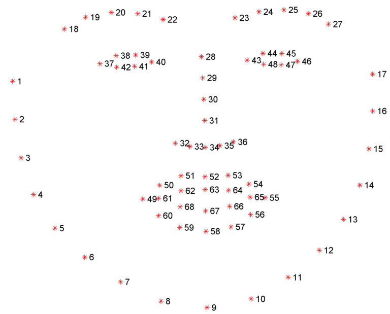

# Deep Learning Projects

 

The dlib library uses a pre-trained face detector which is based on a modification to the Histogram of Oriented Gradients + Linear SVM method for object detection.

The facial landmarks produced by dlib follow an indexable list, as I describe in this tutorial:

Examining the image, we can see that facial regions can be accessed via simple Python indexing (assuming zero-indexing with Python since the image above is one-indexed):

The mouth can be accessed through points [48, 68].
The right eyebrow through points [17, 22].
The left eyebrow through points [22, 27].
The right eye using [36, 42].
The left eye with [42, 48].
The nose using [27, 35].
And the jaw via [0, 17].

# EYE

Based on the work by Soukupová and Čech in their 2016 paper, Real-Time Eye Blink Detection using Facial Landmarks, we can then derive an equation that reflects this relation called the eye aspect ratio (EAR):

# SMILE

Similarly we have applied an equation to predict smile

NUM = ||P51-P59||+||P52-P58||+||P53-P57||
DEN = ||P62-P68||+||P63-P67||+||P64-P66||

MAR = NUM/DEN

# THRESHOLD

We have selected threshold for defining whether person is smiling or not on the basis of MAR. Are there eyes open or not on the basis of EAR. In this project we have chosen following values for threshold:
EAR_Threshold = 0.2
MAR_Threshold = 0.25

# 

